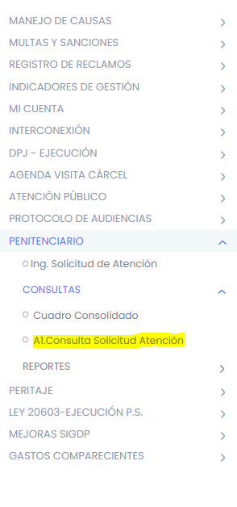
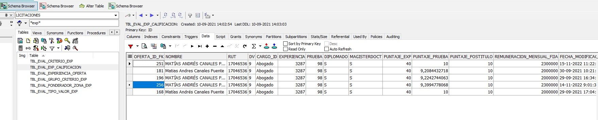
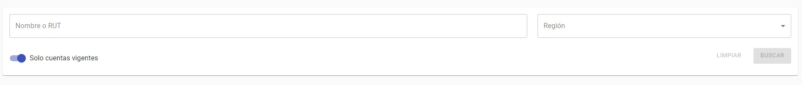

# __SOPORTE SIGDP: Problemas típicos y como resolverlos__ 

<br />

# Tabla de Contenidos
- [__SOPORTE SIGDP: Problemas típicos y como resolverlos__](#soporte-sigdp-problemas-típicos-y-como-resolverlos)
- [Tabla de Contenidos](#tabla-de-contenidos)
  - [__PERITAJE__](#peritaje)
    - [**Cambio de Estado a Peritajes**](#cambio-de-estado-a-peritajes)
    - [**No Descarga Peritaje**](#no-descarga-peritaje)
  - [__CAUSAS__](#causas)
    - [**No es posible crear causa**](#no-es-posible-crear-causa)
    - [**Cambiar Procedimiento a una Causa**](#cambiar-procedimiento-a-una-causa)
  - [**Eliminar Atención y/o Gestión**](#eliminar-atención-yo-gestión)
    - [**Solicita Nuevo RUD o RUD repetidos**](#solicita-nuevo-rud-o-rud-repetidos)
    - [**Tramitación Electrónica**](#tramitación-electrónica)
  - [__PAGOS__](#pagos)
  - [ Informe reporte cierre ](#-informe-reporte-cierre-)
  - [__Ingreso erróneo del RUC__](#ingreso-erróneo-del-ruc)
  - [__Editar Sistema Penitenciario__](#editar-sistema-penitenciario)
  - [__Crear o eliminar un nuevo encargado de Centro de Proceso__](#crear-o-eliminar-un-nuevo-encargado-de-centro-de-proceso)
  - [__Habilitar Módulos a usuarios__](#habilitar-módulos-a-usuarios)
  - [__Modificación de cuentas de sustitución creadas erróneamente__](#modificación-de-cuentas-de-sustitución-creadas-erróneamente)
    - [Para Abogados Licitados:](#para-abogados-licitados)
    - [Para Asistente Abogado Licitado:](#para-asistente-abogado-licitado)
    - [ACTUALIZAR CUENTAS DEL SUSTITUTO](#actualizar-cuentas-del-sustituto)
  - [Actualizar Información del Historial](#actualizar-información-del-historial)
  - [__Eliminar registros__](#eliminar-registros)
  - [__Error al ingresar notificación__](#error-al-ingresar-notificación)
  - [__Volver a un Timestamp anterior en la base de datos__](#volver-a-un-timestamp-anterior-en-la-base-de-datos)
  - [__Problemas con documentos en Gestor Documental__](#problemas-con-documentos-en-gestor-documental)
  - [__Error creación causas automáticas (Se asigna a un DLJ no vigente)__](#error-creación-causas-automáticas-se-asigna-a-un-dlj-no-vigente)
  - [__El RUT seleccionado se encuentra en el listado de equipo de defensa__](#el-rut-seleccionado-se-encuentra-en-el-listado-de-equipo-de-defensa)
  - [__Solicitud de incorporación segunda sub rogante regional o agregar centro a usuario__](#solicitud-de-incorporación-segunda-sub-rogante-regional-o-agregar-centro-a-usuario)

<br />

## __PERITAJE__

<br />

### **Cambio de Estado a Peritajes**

<br />

La mayoría de los problemas en relación al módulo de Peritaje tiene que ver con peritajes mal anulados. De allí que la solicitud por parte del usuario es **Cambio de Estado del Peritaje**. Lo que podemos hacer es deshacer la anulación para que retomen el flujo del Peritaje justo en el estado anterior a la anulación.

Actividad: Modificar el campo ``ESTADO`` de la tabla ``TBL_PTJ_ETAPA_PERITAJE`` para el registro correspondiente. Valor *0* se cambia por *1*.

QUERY:

```
BEGIN
      Update TBL_PTJ_ETAPA_PERITAJE pp
        set PP.ESTADO = '1'   --‘0’
      Where PP.ETAPAPERITAJEID = V_ID;
  
    COMMIT;
END;

```

Casos de Ejemplo: <br />
[Ticket 1](https://redmine.dpp.cl/issues/11099) <br />
[Ticket 2](https://redmine.dpp.cl/issues/10955) <br />
[Ticket 3](https://redmine.dpp.cl/issues/10841) <br />

<br />

### **No Descarga Peritaje**

<br />

En general, cuando se presenta este inconveniente, se trata de peritajes antiguos y por lo general, son documentos que ya no están en el filesystem.

Estas son las rutas conocidas:

```
/u01/oracle/app/admin/dominios/wlssigdp/archivos
/u01/oracle/app/admin/dominios/wlssigdp/nfsfile02/peritaje
```

Casos de Ejemplo: <br />
[Ticket 1](https://redmine.dpp.cl/issues/10966) <br />
[Ticket 2](https://redmine.dpp.cl/issues/10833) <br />
[Ticket 3](https://redmine.dpp.cl/issues/10753) <br />

<br />

## __CAUSAS__

<br />

### **No es posible crear causa**

<br />

Por lo general, se trata de un error en el ``PKG_TBL_TMP_CREACION_IMPUTADO.adm_xml_carga`` (línea 227). Existe más de un registro para la misma causa. Esto provoca un error en dicha línea de código. Se recomienda eliminar el registro temporal de la causa y solicitar al usuario volver a intentar crear la causa.

<br />

**Actividades:**

<br/>
Primero, nos aseguramos que la causa no ha sido creada:

```
Select * from tbl_causa where ruc = '1234567890-9';
```

Segundo, nos aseguramos que exista al menos un registro en la tabla temporal de la causa:

```
Select * from tbl_tmp_causa where ruc = '1234567890-9'; 
```

Tercero, eliminamos todos los registros de esa causas en la tabla temporal:

```
BEGIN
    delete tbl_tmp_causa where ruc = '1234567890-9';
    COMMIT;
END;
```

Casos de Ejemplos:<br/>
[Ticket 1](https://redmine.dpp.cl/issues/11045) <br/>
[Ticket 2](https://redmine.dpp.cl/issues/11019) <br/>

<br/>

### **Cambiar Procedimiento a una Causa**

<br />

Existen ocasiones en que el estado de una causa queda mal establecido y el usuario recurre a soporte para que se modifique el estado. Para ello recurrimos al procedimiento ``SGDP_USER.PKG_SOPORTE_DPP.upd_ProcedEstado``. Sólo debemos proveerlelos parámetros adecuados.

<br/>

**Actividad:**


Identifique el ID de la Causa y el ID del CausaImputado (``CAUSAID`` y ``CAUSAIMPUTADOID``). Luego establezca los valores de ``PROCEDIMIENTOID`` y ``ESTADOPROCESOID`` en el cual quedarán.
Utilice la siguiente Query para obtener el binomio ``PROCEDIMIENTOID``, ``ESTADOPROCESOID``

```
select EP.ESTPROCESOID
      ,EP.GLOSA_ESTADOPROC
      ,EP.PROCEDIMIENTOID
      ,PR.PROCEDIMIENTO 
from tbl_estadoproceso ep 
join tbl_procedimiento pr on PR.PROCEDIMIENTOID = EP.PROCEDIMIENTOID
where EP.ESTPROCESOID != 99
order by EP.PROCEDIMIENTOID , EP.ESTPROCESOID;
```

Luego establezca los parámetros en este procedimiento anónimo y ejecútelo.

```
DECLARE 
  IN_CAUSAIMPUTADOID NUMBER;
  IN_CAUSAID NUMBER;
  IN_PROCEDIMIENTOID NUMBER;
  IN_ESTADOPROCESOID NUMBER;
  OUT_REALIZADO NUMBER;

BEGIN 
  IN_CAUSAIMPUTADOID := NULL;
  IN_CAUSAID := NULL;
  IN_PROCEDIMIENTOID := NULL;
  IN_ESTADOPROCESOID := NULL;
  OUT_REALIZADO := NULL;

  SGDP_USER.PKG_SOPORTE_DPP.UPD_PROCEDESTADO ( IN_CAUSAIMPUTADOID, IN_CAUSAID, IN_PROCEDIMIENTOID, IN_ESTADOPROCESOID, OUT_REALIZADO );
  COMMIT; 
END; 
```

Caso de Ejemplo:<br/>
[Ticket 1](https://redmine.dpp.cl/issues/11129)<br/>

<br/>

## **Eliminar Atención y/o Gestión**

<br/>

**Eliminar Atención**: SIGDP no tiene implementada la funcionalidad de eliminación de Atenciones. Para eliminar una atención, utilícese el procedimiento siguiente: ``SGDP_USER.PKG_SOPORTE_DPP.del_Atencion``. Debe proporcionar el ID de la atención (``IN_ATENCIONID``)

**Actividad**:
Obtenga el ID de la Atención y luego incorpórelo al siguiente procedimiento anónimo.

```
DECLARE 
  IN_ATENCIONID NUMBER;

BEGIN 
  IN_ATENCIONID := NULL;

  SGDP_USER.PKG_SOPORTE_DPP.DEL_ATENCION ( IN_ATENCIONID );
  COMMIT; 
END; 
```

Casos de Ejemplos:<br/>
[Ticket 1](https://redmine.dpp.cl/issues/10897)<br/>
[Ticket 2](https://redmine.dpp.cl/issues/10686)<br/>
[Ticket 3](https://redmine.dpp.cl/issues/10431)<br/>

**Nota**: Una variante a esta solicitud es MODIFICAR LA ATENCION dado que SIGDP no tiene implementada la funcionalidad de editar Atenciones. Para atender este tipo de pedidos estudie los registros sobre las tablas ``tbl_fap_atencion`` y ``tbl_fap_detalleatencion``.

<br/>

### **Solicita Nuevo RUD o RUD repetidos**

<br />

De tanto en tanto, SIGDP genera duplicidad de RUD, los cuales son reportados por los usuarios dueños de causas que se ven afectados por esta situación. Lo que podemos ofrecer como solución es generar un nuevo RUD para esta causa. Para ello utilice el procedimiento ``SGDP_USER.PKG_SOPORTE_DPP.fnt_crea_rud``, para crear el Nuevo RUD y luego actualice la causa con éste RUD.

<br/>

**Actividad**:
Obtenga el ID de la causa (``CAUSAID``). Luego obtenga el tribunal y el año de la Causa. Use el siguiente procedimiento anónimo para modificar el RUD de la Causa. Se obtiene en la siguiente tabla:

```
select * from tbl_causa where upper(ruc) =upper('numero ruc');
```

Luego ejecutar el siguiente bloque:

```
DECLARE 
  RetVal varchar(32767);
  TRIBUNALID_IN VARCHAR2(32767);
  AGNO_IN VARCHAR2(32767);
  V_CAUSAID NUMBER;

BEGIN 
  TRIBUNALID_IN := NULL;
  AGNO_IN       := NULL;
  V_CAUSAID     := NULL;

  RetVal := SGDP_USER.PKG_SOPORTE_DPP.FNT_CREA_RUD ( TRIBUNALID_IN, AGNO_IN );
  
  UPDATE TBL_CAUSA
     SET RUD = RetVal
   WHERE CAUSAID = V_CAUSAID;
   
  COMMIT; 
END;
```

Casos de Ejemplo:<br/>
-Pendiente<br/>

<br />

### **Tramitación Electrónica**

Para este tipo de pedidos, sólo hay que insertar un registro en la tabla ``SGDP_USER.TBL_CAUSAIMPUTADO_RIT_TOP_TMP``.
Se recomienda utilizar el procedimiento ``SGDP_USER.PKG_SOPORTE_DPP.SOP_INSRITTOP``.
<br/>
**Actividad**:
<br/>

Obtenga los siguientes parámetros necesarios para la inserción: ``RIT``, ``Tribunal CAPJ`` y ``CausaImputadoID``.

```
Select CA.CAUSAID
     , CI.CAUSAIMPUTADOID
     , CA.TRIBUNALID
     , TR.NOMTRIBUNAL
     , CT.TRIBUNALID AS CAPJ_TRIBUNALID
     , CT.TRIBUNAL   AS capj_tribunal
     , CA.RIT
     , CA.RUC
     , CA.RUD
     , CI.IMPUTADOID
     , RT.CAUSAIMPUTADOID
     , RT.RIT_TOP
     , RT.TRIBUNAL_CAPJ_ID
from TBL_CAUSA ca
join tbl_causaimputado ci on CI.CAUSAID = CA.CAUSAID 
left join TBL_CAUSAIMPUTADO_RIT_TOP_TMP rt on RT.CAUSAIMPUTADOID = CI.CAUSAIMPUTADOID  
join TBL_TRIBUNAL TR ON TR.TRIBUNALID = CA.TRIBUNALID
left join TBL_CAPJ_TRIBUNAL CT ON CT.DPP_TRIBUNALID = TR.TRIBUNALID AND CT.TRIBUNALID = RT.TRIBUNAL_CAPJ_ID
where CA.RUD = 'OVA-00252-22' ;

```

Luego establezca los valores de los parámetros en el siguiente procedimiento anónimo y ejecútelo. Revise la tabla ``SGDP_USER.TBL_CAUSAIMPUTADO_RIT_TOP_TMP`` y asegúrese que el registro fue insertado.

```
DECLARE 
  IN_RIT VARCHAR2(32767);
  IN_CAUSAIMPUTADO VARCHAR2(32767);
  IN_TRIBUNALCAPJ VARCHAR2(32767);
  O_ERRORCODE NUMBER;
  O_ERRORMSG VARCHAR2(32767);

BEGIN 
  IN_RIT := NULL;
  IN_CAUSAIMPUTADO := NULL;
  IN_TRIBUNALCAPJ := NULL;
  O_ERRORCODE := NULL;
  O_ERRORMSG := NULL;

  SGDP_USER.PKG_SOPORTE_DPP.SOP_INSRITTOP ( IN_RIT, IN_CAUSAIMPUTADO, IN_TRIBUNALCAPJ, O_ERRORCODE, O_ERRORMSG );
  COMMIT; 
END;
```

Casos de Ejemplo:<br/>
[Ticket 1](https://redmine.dpp.cl/issues/11113)

<br />

## __PAGOS__

<br />

La siguiente Query resume el modelo de datos PAGOS.

```
select * 
from tbl_contrato_new cn
join tbl_defensoria df on DF.DEFENSORIAID = CN.DEFENSORIAID
join tbl_informe_pago_enc ip on IP.DEFENSORIAID = DF.DEFENSORIAID
join tbl_pago pg on PG.PAGOID = IP.PAGOID
join tbl_dctotributario dt on DT.DCTOTRIBUTARIOID = PG.DCTOTRIBUTARIOID
join tbl_antecedcontab ac on AC.ANTECEDCONTABID = PG.ANTECEDCONTABID
join seg_fac.facturas fac on FAC.PAGOID = PG.PAGOID 
left join TBL_HISTORIAL_PAGO hp on HP.PAGOID = PG.PAGOID and HP.ESTADOPAGONUEVO = 104
Where CN.CONTRATOID = 7900;
```

Porcentaje Fondo Reserva

```
select CN.FECHAHASTAVIGENCIA, df.* 
from tbl_informe_pago_enc ip
join tbl_defensoria df on DF.DEFENSORIAID = IP.DEFENSORIAID
join tbl_contrato_new cn on CN.DEFENSORIAID = DF.DEFENSORIAID
where upper(ip.XML_CONTRATO) like '%<PORCENTAJEFDORESERVA>5</PORCENTAJEFDORESERVA>%'
  and CN.PORCENTAJEFDORESERVA = 5
  and DF.ESTADO = 'V' 
order by CN.FECHAHASTAVIGENCIA desc;
```

## <ins> Informe reporte cierre </ins>

Obtener la información mediante la siguiente Query, buscando por causa:

```
SELECT DISTINCT
        CI.CAUSAIMPUTADOID,
        CASE
            WHEN (CI.CAUSAIMPUTADOID = CD.CAUSAIMPUTADOID AND CD.FECHA_FIN IS NULL) THEN 'Sí'
        ELSE 'No' END CARPETA_DIGITAL,
        CA.RUD,
        CI.ESTADO,
        TO_CHAR(CA.FECHAINGRESO,'DD-MM-RRRR') FECHA_INGRESO,
        TO_CHAR(CA.FECHAINGRESO,'MM-RRRR') MES_INGRESO,
        TO_CHAR(CI.FECHATERMINO,'DD-MM-RRRR') FECHA_TERMINO,
        TO_CHAR(CI.FECHATERMINO,'MM-RRRR') MES_TERMINO,
        CI.USUPRODEFID USUPRODEFID_CAUSA,
        INITCAP(USU.NOMBRES || ' ' || USU.APPATERNO || ' ' || USU.APMATERNO) DEFENSOR_CAUSA,
        DEF.DEFENSORIAID DEFENSORIAID_CAUSA,
        DEF.NOMDEFENSORIA DEFENSORIA_CAUSA,
        CC.CARPETA_ID,
        CC.ESTADO_CARPETA_ID,
        CEC.NOMBRE_ESTADO ESTADO_CARPETA,
        CC.USUPRODEFID USUPRODEFID_CARPETA,
        INITCAP(USUC.NOMBRES || ' ' || USUC.APPATERNO || ' ' || USUC.APMATERNO) RESPONSABLE_CARPETA,
        DEFC.DEFENSORIAID DEFENSORIAID_CARPETA,
        DEFC.NOMDEFENSORIA DEFENSORIA_CARPETA
   FROM SGDP_USER.TBL_CAUSAIMPUTADO                 CI
        JOIN SGDP_USER.TBL_CAUSA                    CA   ON CA.CAUSAID              = CI.CAUSAID
        JOIN SGDP_USER.TBL_USUPRODEF                PRO  ON PRO.USUPRODEFID         = CI.USUPRODEFID
        JOIN SGDP_USER.TBL_USUARIO                  USU  ON USU.USUARIOID           = PRO.USUARIOID
        JOIN SGDP_USER.TBL_DEFENSORIA               DEF  on def.defensoriaid       = pro.defensoriaid                                     
        LEFT JOIN CARPETA.TBL_CARP_CARPETA          CC   ON CC.CARPETA_ID           = CI.CAUSAIMPUTADOID
        LEFT JOIN CARPETA.TBL_CARP_ESTADO_CARPETA   CEC  ON CEC.ESTADO_CARPETA_ID   = CC.ESTADO_CARPETA_ID
        LEFT JOIN SGDP_USER.TBL_USUPRODEF           PROC ON PROC.USUPRODEFID        = CC.USUPRODEFID
        LEFT JOIN SGDP_USER.TBL_USUARIO             USUC ON USUC.USUARIOID          = PROC.USUARIOID
        LEFT JOIN SGDP_USER.TBL_DEFENSORIA          DEFC ON DEFC.DEFENSORIAID       = PROC.DEFENSORIAID
        LEFT JOIN SGDP_USER.TBL_CAUSAIMPUTADO_CD    CD   ON CD.CAUSAIMPUTADOID      = CI.CAUSAIMPUTADOID AND CD.FECHA_FIN IS NULL
where def.defensoriaid in (11747)
ORDER BY DEF.DEFENSORIAID;

---------------------
select * from tbl_defensoria where NOMDEFENSORIA like '%JLVD SERVICIOS%';
-- JLVD SERVICIOS, ASESORIAS Y CONSULTORIAS SPA Z6 CD 705 22 A = 11746
-- JLVD SERVICIOS, ASESORIAS Y CONSULTORIAS SPA Z6 CD 706 22 B = 11747
```

Guardar como un Excel separando por causa.

<br />

## __Ingreso erróneo del RUC__

<br />

Si el usuario ingresa erróneamente el RUC, es decir intercambiaron el RUC de una causa por otra por lo que al momento de crearla el usuario no puede realizarlo ya que ese RUC está vinculado a una causa, pero el ``IMPUTADOID`` queda nulo. Para solucionar el problema:

<br />

Se debe recabar información, por lo que se tiene la siguiente query:

```
select * from TBL_TMP_CAUSA where ruc = '2201295108-K';
select * from TBL_TMP_CAUSA where ruc = '2310000057-1';
select * from TBL_TMP_CREACION_IMPUTADO where rutimputado = '18519839';
select * from TBL_IMPUTADO where rutimputado = '18519839';
select * from TBL_TMP_CREACION_IMPUTADO where id_cd = 824458;
select * from TBL_TMP_CREACION_IMPUTADO where id_cd = 825687;
```

1.- Primero se debe realizar el reemplazo del RUC en el registro de la tabla temporal:

```
UPDATE TBL_TMP_CAUSA SET ruc='2310000057-1' WHERE RUC = '2300000063-9';
```

**Nota**: Como recomendación se debe utilizar como filtro el ID de la causa:

```
UPDATE TBL_CAUSA SET ruc='2310000057-1' WHERE CAUSAID = 4958811;
```

2.- Posteriormente se debe asociar el ``IMPUTADOID`` correspondiente para que la causa contenga el ID y no aparezca el campo de Imputado descartado en el model de búsqueda por causa de SIGDP

```
update TBL_TMP_CREACION_IMPUTADO set imputadoid = 622286 where id_crea_imp = 2059124;
```

Finalmente, el registro queda asociado a un ``IMPUTADOID`` y a la causa correspondiente.

Ejemplo de Caso:<br/>
[Ticket 1](https://redmine.dpp.cl/issues/11418)

<br />

## __Editar Sistema Penitenciario__

<br />

Para realizar cambios en Sistema penitenciario primero se debe verificar que la informaciónm suministrada es correcta, es decir que ``PETICIONID`` corresponda, debido a que en algunas ocasiones hay usuarios que envían ``PETICIONREQUERIMIENTOID`` en lugar de ``PETICIONID``.

Para esto primero verificamos con las siguientes consultas con el mismo dato suminstrado por el usuario:

```
SELECT * FROM PENITENCIARIO.TBL_PETICION WHERE PETICIONID ='201572753';
SELECT * FROM PENITENCIARIO.TBL_PETICIONREQUERIMIENTO WHERE PETICIONREQUERIMIENTOID ='201572753';
```

Si en ambas consultas contienen información se debe validar con el usuario que el ``PETICIONID`` sea el correcto y no corresponda al ``IDREQUERIMIENTO``. Una vez el usuario confirma la información se debe ingresar a SIGDP para obtener el ID del Requerimiento (``PETICIONREQUERIMIENTOID``).

Acceder a la siguiente opciones para obtener el ID REQUERIMIENTO:

```
-- PENITENCIARIO -> CONSULTAS -> A1.CONSULTA SOLICITUD ATENCIÓN 
```

 

<br/>

Para obtener  ``IDPeticion``, ingresar en la opción de la Lupa en Requerimiento:

<br/>


Luego de obtener el ID del Requerimiento, como recomendación se puede verificar que los datos correspondan mediante la siguiente consulta:

```
SELECT * FROM PENITENCIARIO.TBL_PETICIONREQUERIMIENTO WHERE PETICIONREQUERIMIENTOID ='201855545';
```

Posteriormente se debe realizar la actualización del estado a abierta y se elimina la fecha de término, mediante la utilidad de un PKG de SOPORTE creada con este objetivo (``PKG_SOPORTE_DPP -> upd_ReversaFormaTerminoPet``).
Finalmente, se debe ejecutar la siguiente consulta ingresando ``PETICIONID`` y ``PETICIONREQUERIMIENTOID``:

```
DECLARE 
  IN_PETICIONID NUMBER;
  IN_PETICIONREQUERIMIENTOID NUMBER;
  O_ERRORCODE NUMBER;
  O_ERRORMSG VARCHAR2(32767);

BEGIN 
  IN_PETICIONID := '201572753';
  IN_PETICIONREQUERIMIENTOID := '201855545';
  O_ERRORCODE := NULL;
  O_ERRORMSG := NULL;

  SGDP_USER.PKG_SOPORTE_DPP.UPD_REVERSAFORMATERMINOPET ( IN_PETICIONID, IN_PETICIONREQUERIMIENTOID, O_ERRORCODE, O_ERRORMSG );
  COMMIT; 
END;
```

Validar que los cambios se efectuaron en Replica y posteriormente realizar los cambios en Producción.

Caso de ejemplo: <br/>
[Ticket 1](https://redmine.dpp.cl/issues/11292)

<br />

## __Crear o eliminar un nuevo encargado de Centro de Proceso__

<br/>

1. Habiendo ingresado a Portal Único, ir al módulo Gestor Documental (Proceso de Soporte)


2. Clic en menú Mantenedor de usuario


3. Ingresar el Rut del usuario y presionar el botón de buscar para obtener la información de la persona


4. En la siguiente pantalla se muestran las opciones para habilitar a un nuevo encargado de centro o dar de baja también.


Caso de ejemplo: <br/>
[Ticket 1](https://redmine.dpp.cl/issues/11416) 

<br />

## __Habilitar Módulos a usuarios__ 

<br/>

1. Habilitar módulos para un usuario específico con Administrador de usuario -> Carga de funcionalidades ingresando el rut del usuario:


2. Elegir mediante los checkbox la opción requerida a agregar y posteriormente guardar con el botón en la parte inferior.


3. Habilitar estado de permisos de usuario en algún módulo, mediante Mantenedor de usuario:


<br/>

## __Modificación de cuentas de sustitución creadas erróneamente__

<br/>

**Contexto del caso:**

La nómina en los nuevos contratos creados para el año en curso debería, quedar de la siguiente manera:

<br/>
Zona 6 Talagante
PRESTADOR CONTRATO I (1 JORNADA) JLVD SERVICIOS ASESORIAS Y CONSULTORIAS SPA <br/>
DEFENSOR 1 ORIGINAL: ESAU JOCSAN SERRANO VIDAL <br/>
DEFENSOR SUSTITUTO: FELIPE SILVA PEREZ <br/>

[Ticket](https://redmine.dpp.cl/issues/11509)

<br/>
Primero se debe verificar la información entregada por el usuario, para ello se debe ingresar en Licitación de Defensa-> Crear/Editar Contrato y seleccionar la región que corresponde en este caso Región Metropolitana Sur y el año de licitación en este caso 2022:


Ingresamos en el Listado de Oferentes desde el icono marcado:


Posteriormente se debe hacer clic en el botón de Gestionar nómina:


Una vez que se encuentre en la opción de Equipo de Defensa, se puede verificar la información de los usuarios y su estado:


En esta pantalla se puede obtener el RUT de las cuentas a corregir, información de estado y Cargo. <br/>
Como podemos verificar hay varios errores en este modal, por ejemplo, la cantidad de abogados titulares y asistentes no corresponde a lo que actualmente se muestra, además no muestra los usuarios sustitutos marcados en verde. <br/>
Este es un ejemplo como se debiera ver:


<br/>

**Solución del problema:**

<br/>

1. Obtener información del usuario original y el usuario a sustituir, además del contrato y defensoría asociados.

Verificar que el usuario existe y obtener su ``USUPRODEFID``, a partir de la siguiente query:

```
SELECT USU.NOMBRES||' '||USU.APPATERNO as nombre, USU.USUARIOID, DEF.USUPRODEFID, DEF.FECHAINICIO, DEF.FECHATERMINO , DEF.TIPOUSUARIOID
  FROM tbl_usuario usu, tbl_usuprodef def 
 WHERE usu.rutusuario = 13919730
   AND USU.USUARIOID = DEF.USUARIOID
   AND DEF.ESTADO = 'V';
```

El resultado es algo como esto, si se obtiene más de una cuenta se debe verificar cual es la cuenta que se encuentra activa y discriminamos según su vigencia:


Para identificar el ``USUARIOID`` activo se puede utilizar la siguiente query:

```
SELECT USU.NOMBRES||' '||USU.APPATERNO as nombre, USU.USUARIOID, DEF.USUPRODEFID, DEF.FECHAINICIO, DEF.FECHATERMINO  
  FROM tbl_usuario usu, tbl_usuprodef def 
 WHERE USU.USUARIOID = DEF.USUARIOID
   AND DEF.ESTADO = 'V'
   AND DEF.USUPRODEFID = 33639;
```

El ``CONTRATOID`` y ``DEFENSORIAID`` se obtiene desde Portal único.

<br/>

La otra información se obtiene en el explorador al presionar F12, posteriormente hacer clic en ícono de selector por clic y hacer clic en el nombre de la defensoría, luego identificar el número de contrato marcado en el punto 2:
En el ejemplo el primer número corresponde a ``CONTRATOID`` y el tercero corresponde a ``DEFENSORIAID``.


2. Procedemos a crear la nueva cuenta para usuarios originales, para ello el primer paso es  dejar la cuenta actual inactiva utilizando su ``USUPRODEFID``:

```
UPDATE tbl_usuprodef def SET DEF.ESTADO = 'F' WHERE DEF.USUPRODEFID =31279;
```

3. Creamos la cuenta nueva abogado original. Se deben ingresar los siguientes datos:

- ``USUARIOID``
- ``RUT``
- ``Digito Verificador``
- ``NOMBRES``
- ``APPATERNO``
- ``APMATERNO``
- ``CARGO`` (2 = Abogado licitado, 12 = Asistente, 33 = Abogado reemplazante)
- ``CONTRATO_ID``
- ``FECHADESDE = '01-01-2023'``
- ``FECHAHASTA = '31-12-2025'``

Ejecutamos la query:

```
DECLARE 
      USUARIOID_IN NUMBER;
      RUT_IN VARCHAR2(32767);
      DIG_IN VARCHAR2(32767);
      NOMBRE_IN VARCHAR2(32767);
      APPATERNO_IN VARCHAR2(32767);
      APMATERNO_IN VARCHAR2(32767);
      MAIL_IN VARCHAR2(32767);
      TELEFONO_IN VARCHAR2(32767);
      CARGO_IN NUMBER;
      CONTRATOID_IN NUMBER;
      FECHADESDE_IN VARCHAR2(32767);
      FECHAHASTA_IN VARCHAR2(32767);
      USUPRODEFID_SUSTITUYE_IN NUMBER;
      V_IDUSUARIO NUMBER;
      V_IPUSUARIO VARCHAR2(32767);
      IO_CURSOR SGDP_USER.PKG_LIC_INS_NOMINA.ccursor_resultado;

    BEGIN 
      USUARIOID_IN := 12206;
      RUT_IN := 17046536;
      DIG_IN := '9';
      NOMBRE_IN := 'MATÍAS ANDRÉS';
      APPATERNO_IN := 'CANALES';
      APMATERNO_IN := 'PUENTE';
      MAIL_IN := 'mail@mail.cl';
      TELEFONO_IN := null;
      CARGO_IN := 2;-- Abogado Licitado
      CONTRATOID_IN := 9320;
      FECHADESDE_IN := '01-01-2023';
      FECHAHASTA_IN := '31-12-2025';
      USUPRODEFID_SUSTITUYE_IN := NULL;
      V_IDUSUARIO := NULL;
      V_IPUSUARIO := NULL;
      IO_CURSOR := NULL;

      SGDP_USER.PKG_LIC_INS_NOMINA.SP_INS_NOMINA ( USUARIOID_IN, RUT_IN, DIG_IN, NOMBRE_IN, APPATERNO_IN, APMATERNO_IN, MAIL_IN, TELEFONO_IN, CARGO_IN, CONTRATOID_IN, FECHADESDE_IN, FECHAHASTA_IN, USUPRODEFID_SUSTITUYE_IN, V_IDUSUARIO, V_IPUSUARIO, IO_CURSOR );
      COMMIT; 
    END;
```

### Para Abogados Licitados:

```
DECLARE 
      USUARIOID_IN NUMBER;
      RUT_IN VARCHAR2(32767);
      DIG_IN VARCHAR2(32767);
      NOMBRE_IN VARCHAR2(32767);
      APPATERNO_IN VARCHAR2(32767);
      APMATERNO_IN VARCHAR2(32767);
      MAIL_IN VARCHAR2(32767);
      TELEFONO_IN VARCHAR2(32767);
      CARGO_IN NUMBER;
      CONTRATOID_IN NUMBER;
      FECHADESDE_IN VARCHAR2(32767);
   FECHAHASTA_IN VARCHAR2(32767);
      USUPRODEFID_SUSTITUYE_IN NUMBER;
      V_IDUSUARIO NUMBER;
      V_IPUSUARIO VARCHAR2(32767);
      IO_CURSOR SGDP_USER.PKG_LIC_INS_NOMINA.ccursor_resultado;

    BEGIN 
      USUARIOID_IN := 10377;
      RUT_IN := 17228391;
      DIG_IN := '8';
      NOMBRE_IN := 'ESAU JOCSAN';
      APPATERNO_IN := 'SERRANO';
      APMATERNO_IN := 'VIDAL';
      MAIL_IN := 'mail@mail.cl';
      TELEFONO_IN := null;
      CARGO_IN := 2;-- Abogado Licitado
      CONTRATOID_IN := 9329;
      FECHADESDE_IN := '01-01-2023';
      FECHAHASTA_IN := '31-12-2025';
      USUPRODEFID_SUSTITUYE_IN := NULL;
      V_IDUSUARIO := NULL;
      V_IPUSUARIO := NULL;
      IO_CURSOR := NULL;

SGDP_USER.PKG_LIC_INS_NOMINA.SP_INS_NOMINA ( USUARIOID_IN, RUT_IN, DIG_IN, NOMBRE_IN, APPATERNO_IN, APMATERNO_IN, MAIL_IN, TELEFONO_IN, CARGO_IN, CONTRATOID_IN, FECHADESDE_IN, FECHAHASTA_IN, USUPRODEFID_SUSTITUYE_IN, V_IDUSUARIO, V_IPUSUARIO, IO_CURSOR );
      COMMIT; 
    END;
```

### Para Asistente Abogado Licitado:

4. Se debe ejecutar la misma query pero modificando los datos correspondientes es decir los mismos de antes, pero en el cargo se debe cambiar por 12, que corresponde al Asistente de abogado licitado:

```
BEGIN 
      USUARIOID_IN := 14267;
      RUT_IN := 19409328;
      DIG_IN := '4';
      NOMBRE_IN := 'NICOLÁS ALEXANDER';
      APPATERNO_IN := 'ACEVEDO';
      APMATERNO_IN := 'ESPINOZA';
      MAIL_IN := 'mail@mail.cl';
      TELEFONO_IN := null;
      CARGO_IN := 12;-- Asistente Abogado Licitado
      CONTRATOID_IN := 9329;
      FECHADESDE_IN := '01-01-2023';
      FECHAHASTA_IN := '31-12-2025';
      USUPRODEFID_SUSTITUYE_IN := NULL;
      V_IDUSUARIO := NULL;
      V_IPUSUARIO := NULL;
      IO_CURSOR := NULL;

      SGDP_USER.PKG_LIC_INS_NOMINA.SP_INS_NOMINA ( USUARIOID_IN, RUT_IN, DIG_IN, NOMBRE_IN, APPATERNO_IN, APMATERNO_IN, MAIL_IN, TELEFONO_IN, CARGO_IN, CONTRATOID_IN, FECHADESDE_IN, FECHAHASTA_IN, USUPRODEFID_SUSTITUYE_IN, V_IDUSUARIO, V_IPUSUARIO, IO_CURSOR );
      COMMIT; 
    END;
```

### ACTUALIZAR CUENTAS DEL SUSTITUTO

Luego de crear la cuenta se debe volver a consultar el ``USUPRODEFID`` para realizar la sustitución, la lógica sería de la siguiente forma:

<br/>

``Usuario nuevo sustituye al original`` ``(USUPRODEFID_SUSTITUYE)``

<br/>

Esto se realiza mediante la siguiente query:

```
update tbl_usuprodef def 
   set DEF.USUPRODEFID_SUSTITUYE = 33914
 where DEF.USUPRODEFID = 33638;-- Usuario Nuevo
```

Dejar inactiva la cuenta del usuario reemplazado:

```
UPDATE tbl_usuprodef def SET DEF.ESTADO = 'F' WHERE DEF.USUPRODEFID =33914;
```

Insertar historial de sustitución de usuarios:

   Se debe recopilar información antes de realizar la query, para ello en Toad creamos un Shema Browser posteriormente accedemos en:
   ``LICITACIONES``->``TBL_EVAL_EXP_CALIFICACION``-> ``pestaña Data``:



Filtramos por RUT y obtenemos las calificaciones del usuario:


Para abogados se debe ejecutar la siguiente query:

```
Insert into LICITACIONES.TBL_HIST_SUSTITUYENTE

            (HISTSUSTID, 
            DEFENSORIAID, 
            CONTRATOID, 
            USUPRODEFID_NEW, 
            EXPERIENCIA_NEW,
            PRUEBA_NEW,
            DIPLOMADO_NEW,
            MAGISTERDOCT_NEW,
            USUPRODEFID_OLD, 
            EXPERIENCIA_OLD,
            PRUEBA_OLD,
            DIPLOMADO_OLD, 
            MAGISTERDOCT_OLD, 
            OBSERVACION_CALIF,
            RUTOFER_ORI, 
            LIMITESUSTITUCIONES,
            TIPOUSUARIOID, 
            USUPRODEFID_MODIF, 
            FECHA_COMPUTO)
          
     Values (  LICITACIONES.TBL_HIST_SUSTITUYENTE_SQ.NEXTVAL, 
               11850, -- DEFENSORIAID
               9320, -- CONTRATOID             
               33357, -- USUPRODEFID_NEW             
               '900',-- EXPERIENCIA_NEW
               '82',-- PRUEBA_NEW
               'N',-- DIPLOMADO_NEW
               'N',-- MAGISTERDOCT_NEW             
               33914, -- USUPRODEFID_OLD
               null,-- EXPERIENCIA_OLD
               null,-- PRUEBA_OLD
               'N',-- DIPLOMADO_OLD
               'N',-- MAGISTERDOCT_OLD  
               '', -- OBSERVACION_CALIF
               '17228391-8', -- Rut del integrante original de la evaluacion de oferta RUTOFER_ORI
               'N',
               2, -- TIPOUSUARIOID
               0, -- Usuario que creó el registro USUPRODEFID_MODIF
               TO_DATE('01/16/2023 00:00:00', 'MM/DD/YYYY HH24:MI:SS')--FECHA_COMPUTO
               );
```

Para Asistentes, la diferencia radica el ``TIPOUSUARIOID`` y en la capacitación del usuario, es decir si tiene magister, doctorados y sus calificaciones las cuales están relacionadas al cargo, en este caso no es necesario llenar estos campos:

```
Insert into LICITACIONES.TBL_HIST_SUSTITUYENTE

            (HISTSUSTID, 
            DEFENSORIAID, 
            CONTRATOID, 
            USUPRODEFID_NEW, 
            EXPERIENCIA_NEW,
            PRUEBA_NEW,
            DIPLOMADO_NEW,
            MAGISTERDOCT_NEW,
            USUPRODEFID_OLD, 
            EXPERIENCIA_OLD,
            PRUEBA_OLD,
            DIPLOMADO_OLD, 
            MAGISTERDOCT_OLD, 
            OBSERVACION_CALIF,
            RUTOFER_ORI, 
            LIMITESUSTITUCIONES,
            TIPOUSUARIOID, 
            USUPRODEFID_MODIF, 
            FECHA_COMPUTO)
          
     Values (  LICITACIONES.TBL_HIST_SUSTITUYENTE_SQ.NEXTVAL, 
               11859, -- DEFENSORIAID
               9329, -- CONTRATOID             
               33638, -- USUPRODEFID_NEW             
               null,-- EXPERIENCIA_NEW
               null,-- PRUEBA_NEW
               '-',-- DIPLOMADO_NEW
               '-',-- MAGISTERDOCT_NEW             
               33894, -- USUPRODEFID_OLD
               null,-- EXPERIENCIA_OLD
               null,-- PRUEBA_OLD
               '-',-- DIPLOMADO_OLD
               '-',-- MAGISTERDOCT_OLD  
               '', -- OBSERVACION_CALIF
               '19409328-4', -- Rut del integrante original de la evaluacion de oferta RUTOFER_ORI
               'N',
               12, -- TIPOUSUARIOID
               0, -- Usuario que creó el registro USUPRODEFID_MODIF
               TO_DATE('01/16/2023 00:00:00', 'MM/DD/YYYY HH24:MI:SS')--FECHA_COMPUTO
               );
```

Finalmente se debe verificar mediante Portal Único si los cambios se hicieron de forma satisfactoria.

## Actualizar Información del Historial

Para actualizar la información del historial se debe ingresar la información necesaria y la fecha actual para la creación del registro. También se debe recopilar los datos relacionados con las credenciales del usuario.


Para actualizar el historial del abogado licitado sustituyente se debe ejecutar el siguiente código:

```
Insert into LICITACIONES.TBL_HIST_SUSTITUYENTE

            (HISTSUSTID, 
            DEFENSORIAID, 
            CONTRATOID, 
            USUPRODEFID_NEW, 
            EXPERIENCIA_NEW,
            PRUEBA_NEW,
            DIPLOMADO_NEW,
            MAGISTERDOCT_NEW,
            USUPRODEFID_OLD, 
            EXPERIENCIA_OLD,
            PRUEBA_OLD,
            DIPLOMADO_OLD, 
            MAGISTERDOCT_OLD, 
            OBSERVACION_CALIF,
            RUTOFER_ORI, 
            LIMITESUSTITUCIONES,
            TIPOUSUARIOID, 
            USUPRODEFID_MODIF,
            FECHA_COMPUTO)
          
     Values (LICITACIONES.TBL_HIST_SUSTITUYENTE_SQ.NEXTVAL, 
               11859, -- DEFENSORIAID
               9329, -- CONTRATOID             
               33639, -- USUPRODEFID_NEW             
               '900',-- EXPERIENCIA_NEW
               '82',-- PRUEBA_NEW
               'N',-- DIPLOMADO_NEW
               'N',-- MAGISTERDOCT_NEW             
               33913, -- USUPRODEFID_OLD
               3373,-- EXPERIENCIA_OLD
               100,-- PRUEBA_OLD
               'S',-- DIPLOMADO_OLD
               'S',-- MAGISTERDOCT_OLD  
               '', -- OBSERVACION_CALIF
               '17228391-8', -- Rut del integrante original de la evaluacion de oferta RUTOFER_ORI
               'N',
               2, -- TIPOUSUARIOID
               0, -- Usuario que creó el registro USUPRODEFID_MODIF
               TO_DATE('01/17/2023 00:00:00', 'MM/DD/YYYY HH24:MI:SS')--FECHA_COMPUTO
               );
```

Para actualizar el historial del abogado asistente se debe ejecutar el siguiente código:

```
Insert into LICITACIONES.TBL_HIST_SUSTITUYENTE

            (HISTSUSTID, 
            DEFENSORIAID, 
            CONTRATOID, 
            USUPRODEFID_NEW, 
            EXPERIENCIA_NEW,
            PRUEBA_NEW,
            DIPLOMADO_NEW,
            MAGISTERDOCT_NEW,
            USUPRODEFID_OLD, 
            EXPERIENCIA_OLD,
            PRUEBA_OLD,
            DIPLOMADO_OLD, 
            MAGISTERDOCT_OLD, 
            OBSERVACION_CALIF,
            RUTOFER_ORI, 
            LIMITESUSTITUCIONES,
            TIPOUSUARIOID, 
            USUPRODEFID_MODIF, 
            FECHA_COMPUTO)
          
     Values (  LICITACIONES.TBL_HIST_SUSTITUYENTE_SQ.NEXTVAL, 
               11859, -- DEFENSORIAID
               9329, -- CONTRATOID             
               33638, -- USUPRODEFID_NEW             
               null,-- EXPERIENCIA_NEW
               null,-- PRUEBA_NEW
               '-',-- DIPLOMADO_NEW
               '-',-- MAGISTERDOCT_NEW             
               33914, -- USUPRODEFID_OLD
               null,-- EXPERIENCIA_OLD
               null,-- PRUEBA_OLD
               '-',-- DIPLOMADO_OLD
               '-',-- MAGISTERDOCT_OLD  
               '', -- OBSERVACION_CALIF
               '19409328-4', -- Rut del integrante original de la evaluacion de oferta RUTOFER_ORI
               'N',
               12, -- TIPOUSUARIOID
               0, -- Usuario que creó el registro USUPRODEFID_MODIF
               TO_DATE('01/17/2023 00:00:00', 'MM/DD/YYYY HH24:MI:SS')--FECHA_COMPUTO
               );
```

<br />

## __Eliminar registros__

<br />

En caso de crear más de una sustitución se debe ingresar en ``Shema Browser`` -> ``LICITACIONES`` -> ``TBL_HIST_SUSTITUYENTE`` luego ir a la pestaña ``Data``:


Hacer clic en la primera columna para cambiar el orden de la columna y seleccionar orden descendente:


Luego, seleccionar el registro a eliminar y presionar – para eliminarlo y finalmente hacer ``COMMIT``.

<br />

## __Error al ingresar notificación__

<br />

Al ingresar una notificación al imputado el sistema arroja un error en Registro de gestiones para una causa específica.
El problema se debe a ``REGISTROID`` duplicados en la tabla ``tbl_agendadetallepp``.


1. Verificar que en MsObtenerGestionesCausa arroja el mismo error (5XX).
2. Buscar RUT del usuario que presenta el problema para ingresar en SIGDP y reproducir el error, buscamos el RUT mediante la siguiente query:

```
select * from tbl_usuprodef where usuprodefid=32258;
```

3. Verificamos cuales registros se encuentran duplicados con:

```
select * from tbl_agendadetallepp WHERE CAUSAIMPUTADOID = 5687173;
```

4. Obtenemos el siguiente resultado:


5. Identificamos los registros con ``REGISTROGESTIONID`` duplicados y procedemos a eliminarlos mediante la siguiente query:

```
delete from tbl_agendadetallepp WHERE AGENDADETALLEID IN(2353240,2338226);
```

6. Verificar si dejando vacío el campo de uno sigue funcionando correctamente y posteriormente verificar que se resolvió el problema en SIGDP.


Ejemplo de Caso:

[Ticket](https://redmine.dpp.cl/issues/11414)

<br />

## __Volver a un Timestamp anterior en la base de datos__

<br />

Para volver a un Timestamp anterior en la base de datos se debe ejecutar la siguiente query:


```
INSERT INTO TBL_AGENDADETALLEPP
SELECT * FROM TBL_AGENDADETALLEPP AS OF TIMESTAMP
    to_timestamp('23-01-2023 09:35:00', 'dd-mm-yyyy HH:MI:SS') WHERE CAUSAIMPUTADOID = '5687173';
```

<br />

## __Problemas con documentos en Gestor Documental__

<br />


Cuando hay problemas de Archivos no encontrados o errores relacionados con archivos puede ingresar en ``Potal Único -> Gestor Documental -> Corrector docs``, cabe señalar que las correcciones se deben realizar en producción y se debe actualizar cada archive para corregir el problema.


<br />

## __Error creación causas automáticas (Se asigna a un DLJ no vigente)__

<br />

Al crear causas automáticamente estas se asignan a un DLJ no vigente, para resolver el problema debemos ejecutar PKG que se encuentra en la siguiente ruta:

```SGDP_USER ->PKG_SOPORTE_DPP -> upd_DLJ_causautomatica ```

Antes de ejecutar el PKG debemos obtener el TRIBUNALID y el USUPRODEFID al que deseamos asociar ese tribunal. Esto se obtiene mediante las siguientes query:

Obtenemos el TRIBUNALID con:

```
select * from tbl_tribunal where upper(nomtribunal) like upper('%osorno%');
Verificamos las cuentas vigentes para el tribunal:
select * from TBL_TRIBUNALES_DLJ_CREA_CAUSA where tribunalid =109;

```


Además se debe tener en consideración si el usuario tiene más de una cuenta activa e identificar cual es la cuenta que tiene causas asociadas, para ello podemos ejecutar las siguientes querys:

```

select * from tbl_causaimputado where usuprodefid = 32501 and estado ='A';
Si no encuentra causas con ESTADO ‘A’, utilizar esta query:
select * from tbl_causaimputado where usuprodefid = 32510;

```

 Una vez tenemos el ```TRIBUNALID``` y el ```USUPRODEFID``` ejecutamos la siguiente query, ingresando las variables correspondientes:


```
DECLARE 
  TRIBUNALID_IN NUMBER;
  USUPRODEFID_IN NUMBER;
  O_ERRORCODE NUMBER;
  O_ERRORMSG VARCHAR2(32767);

BEGIN 
  TRIBUNALID_IN := 109;
  USUPRODEFID_IN := 33501;
  O_ERRORCODE := NULL;
  O_ERRORMSG := NULL;

  SGDP_USER.PKG_SOPORTE_DPP.UPD_DLJ_CAUSAUTOMATICA ( TRIBUNALID_IN, USUPRODEFID_IN, O_ERRORCODE, O_ERRORMSG );
END;
```


Finalmente verificamos que la información sea correcta mediante:

```
select * from TBL_TRIBUNALES_DLJ_CREA_CAUSA where tribunalid =109;
```

Generalmente mostrará la cuenta active y las cuentas inactivas.

Caso de Ejemplo:

[Ticket](https://redmine.dpp.cl/issues/11515)

<br />

## __El RUT seleccionado se encuentra en el listado de equipo de defensa__

<br />

Este problema ocurre cuando el usuario existe en la nómina antes de realizar la sustitución, debido a que se crea el perfil nuevo mediante el botón agregar integrante.


La forma correcta de sustituir sería utilizar el botón de sustitución, el cual crea la cuenta y al mismo tiempo sustituye.

Una solución que se puede implementar fácilmente es eliminar el registro mediante el ``USUPRODEFID`` y luego hacer la sustitución como corresponde. Se debe tener precaución antes de eliminar al usuario verificando que no existan registros asociados a esa cuenta, es decir que no haya realizado ninguna acción en el sistema con esa cuenta.

Una vez verificado se puede realizar el cambio utilizando la siguiente query y luego presionar el botón de sustitución que crea una nueva cuenta para el usuario sustituto y lo deja activo:

```
delete tbl_usuprodef where usuprodefid = '33024';
```


Si el cambio se realiza correctamente el usuario anterior no debiera aparecer en la lista, además debe marcar al usuario sustituto de color verde, por último, se debe llenar la información del historial de sustitución.


Si al momento de ejecutar la eliminación de la cuenta nos arroja un error, puede indicar que esta cuenta tiene asociada varios registros en otras tablas, en ese caso se solucionaría de la siguiente manera:
Sustitución de cuenta original(``USUPRODEFID_SUSTITUYE``) por la nueva cuenta:

```
UPDATE TBL_USUPRODEF DEF 
   SET DEF.USUPRODEFID_SUSTITUYE = 31720 
   WHERE DEF.USUPRODEFID = 33024;--Nuevo USUPRODEFID
```
 
Dejamos inactiva la cuenta del usuario sustituido y ponemos como fecha de término una fecha anterior a la actual, esto para que no se muestre en la lista del contrato:

```
UPDATE TBL_USUPRODEF DEF SET DEF.ESTADO = 'F', FECHATERMINO='27-01-2023'    WHERE DEF.USUPRODEFID =33917;

```

Posteriormente modificamos el historial para que contenga la información del reemplazo, para obtener la información del usuario ingresamos en ```LICITACIONES -> TBL_EVAL_EXP_CAPACITACION``` y filtramos por RUT sin DV:


Obtenemos los siguientes datos:

- EXPERIENCIA
- PUNTAJE_PBA
- DIPLOMADO
- MAGISTER

Esta información se utilizará para llenar el historial de reemplazo.

<br />

## __Solicitud de incorporación segunda sub rogante regional o agregar centro a usuario__

<br />

Primero, en el caso del sub rogante debe venir adjunto al ticket la resolución exenta indicando que el usuario está autorizado a realizar las labores del cargo, si este no viene se debe solicitar.
Posteriormente se debe ingresar con una cuenta con privilegios de edición de gestor documental, luego se requiere asignar las facultades en Portal Único como sub rogante regional, para ello se debe ingresar en ```Gestor Documental -> Mantenedor de Usuarios```:


Luego se debe ingresar el Rut del usuario que quiere asignar la tarea o centro.



Nos mostrará la siguiente ventana:


En este caso el usuario tiene más de una cuenta, por lo que debemos comprobar cuál es la cuenta con la que necesitamos trabajar:


Posteriormente se debe seleccionar la opción de Mi Centro de Proceso:


Y se selecciona el centro al cual se requiere agregar:


Una vez que se selecciona el centro se debe activar cambiando el estado:


Si el perfil es de visador se activa la opción con el mismo nombre:


También en la opción de Firmador se puede habilitar si puede hacerlo, cuando no se tiene información del cargo y unidad se debe ingresar: “No se tiene información”


Para agregar al usuario como subrogante podemos hacer clic en el botón creado para esta acción:


Ejemplo de caso:

[Ticket](https://redmine.dpp.cl/issues/11578)